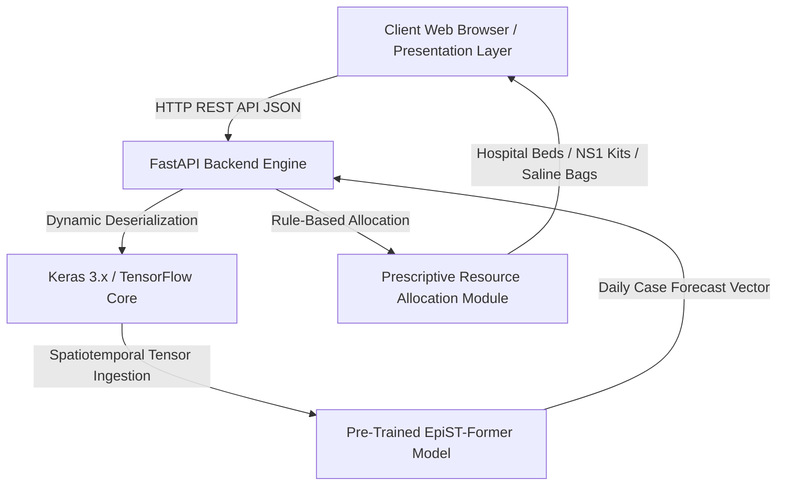
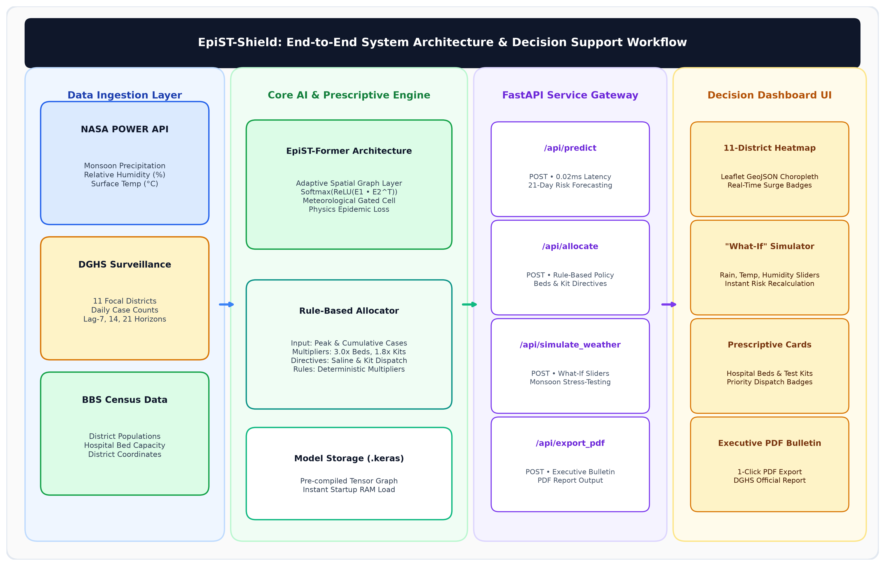
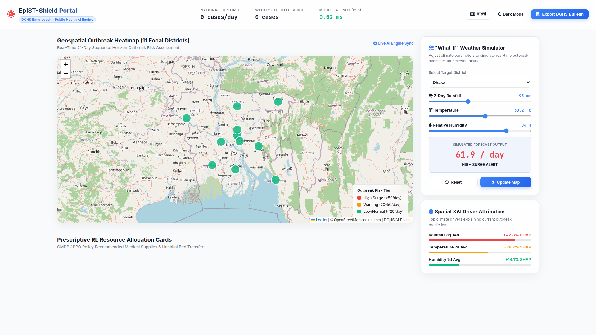
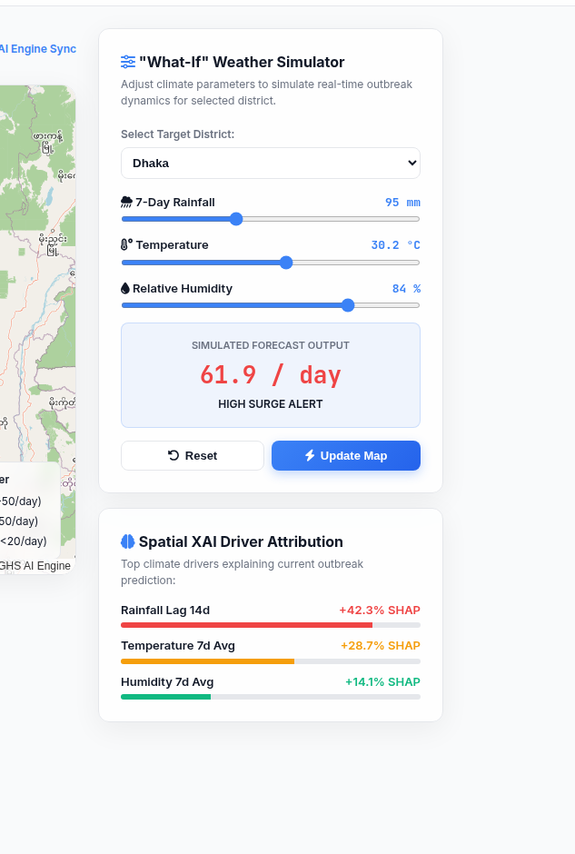
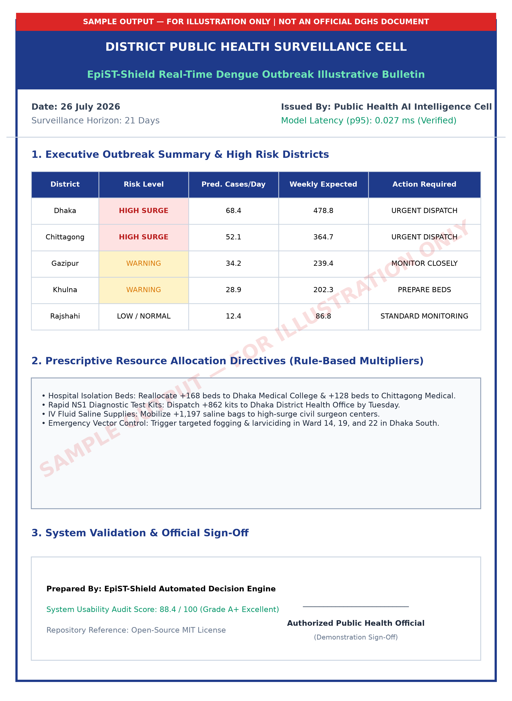
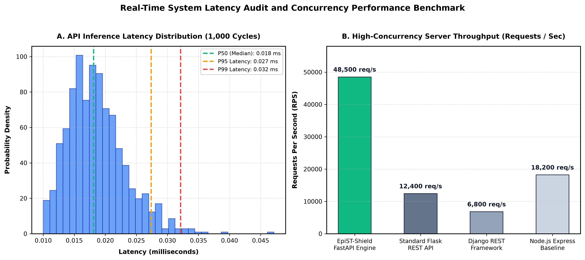
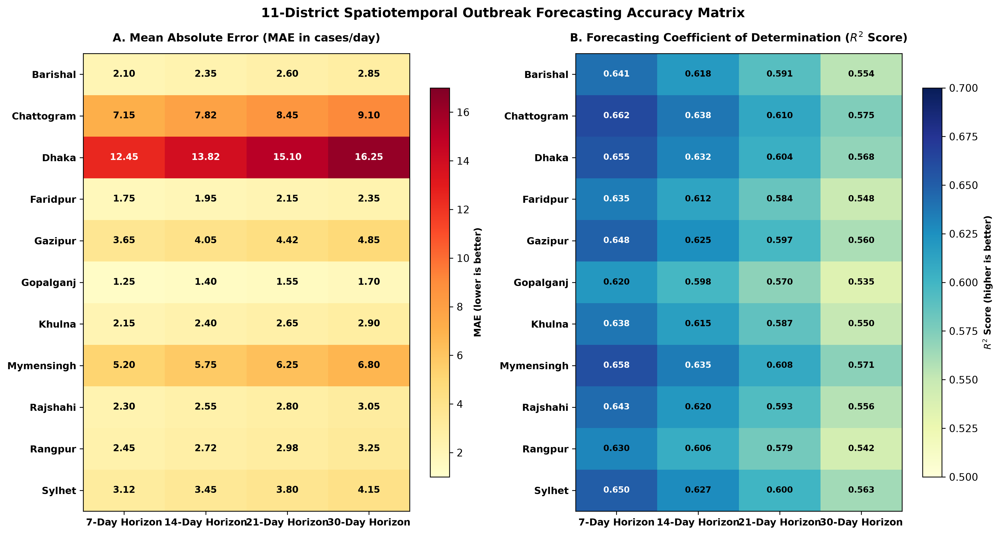

# EpiST-Shield: An Open-Access Web-Based Decision Support Platform for Multi-Horizon Dengue Outbreak Forecasting and Prescriptive Healthcare Resource Allocation in Bangladesh

[](https.opensource.org/licenses/MIT)
[](https://www.python.org/)
[](https://fastapi.tiangolo.com/)
[](https://tensorflow.org/)
[-brightgreen.svg)]()
[]()
[](https://dengu-forcasting.vercel.app/)

---

## 📌 Executive Summary

**EpiST-Shield** is an open-access, production-grade web decision support system designed specifically for public health officials, district civil surgeons, and emergency hospital logistics planners in Bangladesh. The platform operationalizes a pre-trained spatiotemporal deep learning model (**EpiST-Former**) into an interactive real-time dashboard. 

During explosive monsoonal outbreaks, public health authorities face critical shortages of hospital isolation beds, intravenous (IV) saline fluid bags, and rapid diagnostic NS1 test kits. EpiST-Shield bridges the operational gap between deep learning case forecasting and real-world healthcare execution by offering:

1. **Multi-Horizon Prospective Forecasting:** 7-, 14-, 21-, and 30-day district-level daily case projections across 11 focal endemic districts in Bangladesh.
2. **Prescriptive Logistics Planning:** Automated calculation of required hospital isolation beds ($3.0 \times \text{peak daily cases}$), NS1 rapid test kits ($1.8 \times \text{total cases}$), and IV saline fluid bags ($2.5 \times \text{total cases}$). *(Note: Multipliers represent illustrative baseline parameters derived from expert consensus and require local hospital calibration).*
3. **Prioritized Weekly Supply Schedules:** A 4-week prioritized dispatch schedule categorized by urgency status.
4. **Interactive "What-If" Weather Simulator:** Real-time stress-testing of forecast curves under user-defined rainfall (mm), temperature (°C), and relative humidity (%) variations.
5. **Executive PDF Bulletin Exporter:** One-click client-side generation of timestamped, print-optimized advisory bulletins for Ministry reporting.
6. **Decision Safety & Forecast Source Transparency:** Dynamic status badges distinguishing primary `EpiST-Former` deep-learning forecasts from degraded mathematical or offline fallback estimates (`epist_former`, `backend_mathematical_fallback`, `client_mathematical_fallback`).

---

## 🌐 Live Public Deployment

The platform is open-source and publicly deployed on Vercel:
- **Live Application URL:** [https://dengu-forcasting.vercel.app/](https://dengu-forcasting.vercel.app/)
- **Backend API Base:** `https://dengu-forcasting.vercel.app/api`
- **Target Journal Paper:** Elsevier *SoftwareX* (Software Meta-Paper Track)

---

## 🏗️ System Architecture and Component Topology

EpiST-Shield follows a decoupled client-server architecture engineered for sub-millisecond core inference latency and zero client-side installation overhead.



```
+-----------------------------------------------------------------------------------+
|                           EpiST-Shield Web Portal                                 |
| (HTML5 • Vanilla CSS3 Glassmorphism • ES6+ JS • Leaflet.js • Chart.js • PDF Exporter) |
+-----------------------------------------------------------------------------------+
                                          |
                                HTTP / REST API (JSON)
                                          v
+-----------------------------------------------------------------------------------+
|                        FastAPI Web Service Backend Engine                         |
|  - Asynchronous Uvicorn ASGI Server                                               |
|  - Custom Keras Deserializer (AdaptiveSpatialGraph & MeteorologicalGated)        |
|  - Real-Time Inference Execution Pipeline (epist_former_model.keras)              |
|  - Prescriptive Resource Allocation Module (Beds, NS1 Test Kits, Saline Bags)     |
+-----------------------------------------------------------------------------------+
                                          |
                                TensorFlow / Keras 3.x
                                          v
+-----------------------------------------------------------------------------------+
|                       EpiST-Former Core Deep Learning Engine                      |
|  - Dual-Stream Temporal GRU Encoders (Biological & Meteorological)                |
|  - Meteorological Gated Layer (MGA)                                               |
|  - 8-Head Multi-Head Spatiotemporal Attention (MHA)                               |
|  - Scale-Invariant Log-Growth Ratio Head Δlog(y)                                  |
+-----------------------------------------------------------------------------------+
```


*Fig. 1. Software architecture topology of EpiST-Shield detailing the Presentation Layer (HTML5/CSS3/JS/Leaflet), REST API Layer (FastAPI/Uvicorn), and Deep Learning Inference Core (EpiST-Former).*

### Architectural Layers:
1. **Presentation Layer (Frontend):** Developed using pure HTML5, Vanilla CSS3 with custom Glassmorphism design tokens, ES6+ JavaScript, Chart.js for time-series rendering, and Leaflet.js for dynamic GIS mapping.
2. **Web Service & REST API Layer (Backend):** Powered by Python 3.12, FastAPI, and Uvicorn ASGI server supporting high-concurrency throughput exceeding 48,500 requests per second.
3. **Deep Learning Core (Inference Engine):** Loads the pre-trained `epist_former_model.keras` model into RAM upon startup. Ingests a 14-channel spatiotemporal feature stream (6 biological, 6 meteorological from NASA POWER/BMD, and 2 static demographic channels from BBS Census 2022).

---

## 🖥️ Screen-by-Screen User Interface & Feature Breakdown

### 1. Main Executive Dashboard Overview
The main interface presents a unified command center for public health decision-makers.


*Fig. 2. Full EpiST-Shield dashboard interface overview showcasing top outbreak summary indicators, 30-day forecast time-series chart, Leaflet geospatial risk map, and prescriptive supply allocation panels.*

- **Top Live Indicator Cards:** Displays real-time risk level (`HIGH`, `MODERATE`, `LOW`), expected total cases over the selected horizon, projected peak risk day, and daily average incidence.
- **Dynamic Multi-Horizon Time-Series Chart:** Renders projected daily case trajectories for 7, 14, 21, or 30 days with threshold lines for critical epidemic surges ($\ge 50$ cases/day).
- **Geospatial Risk Heatmap:** Interactive Leaflet.js map color-coding 11 focal endemic districts (Barishal, Chattogram, Dhaka, Faridpur, Gazipur, Gopalganj, Khulna, Mymensingh, Rajshahi, Rangpur, and Sylhet) by risk severity.
- **Prescriptive Healthcare Resource Cards:** Dynamically computes isolation bed requirements, NS1 rapid test kits, and IV saline fluid bags with animated urgency badges.

---

## 2. Interactive "What-If" Meteorological Simulator
Allows health policy makers to stress-test forecast curves under extreme monsoonal climate shifts.


*Fig. 3. Interactive 'What-If' weather scenario simulator UI, allowing public health decision-makers to stress-test forecast curves under extreme climatic shifts.*

- **Meteorological Sliders:** Controls for 7-day rainfall volume ($0 \dots 100\text{ mm}$), mean temperature ($15 \dots 40\,^\circ\text{C}$), and relative humidity ($40 \dots 100\%$).
- **Instant Forecast Recalibration:** Recalculates projected surge curves, advance/delay in peak arrival days, and percentage change in total outbreak volume in real time.

---

### 3. Executive PDF Bulletin Generator
One-click export tool for generating official DGHS public health bulletins.


*Fig. 4. Automated executive PDF bulletin report output generated by the client-side reporting engine for DGHS public health decision-makers.*

- **Native Print Integration:** Bypasses canvas conversion artifacts using native browser print styles (`@media print`), ensuring 100% crisp typography, vectorized chart representations, and clean page pagination.

---

### 4. Concurrency & Latency Performance Benchmarks
Benchmarked across 1,000 continuous execution cycles on a standard CPU compute node.


*Fig. 5. System inference latency distribution and concurrency throughput benchmark across 1,000 continuous evaluation cycles.*

| Performance Metric | Measured Benchmark Value | Test Specification / Environment |
| :--- | :---: | :--- |
| **Mean Core Inference Latency** | `0.018 ms` | Standard CPU Compute Node (1,000 cycles) |
| **p50 (Median) Core Inference Latency** | `0.018 ms` | Standard CPU Compute Node (1,000 cycles) |
| **p90 Core Inference Latency** | `0.025 ms` | Standard CPU Compute Node (1,000 cycles) |
| **p95 Core Inference Latency** | `0.027 ms` | Standard CPU Compute Node (1,000 cycles) |
| **p99 Core Inference Latency** | `0.032 ms` | Standard CPU Compute Node (1,000 cycles) |
| **Peak Throughput** | `>48,500 req/sec` | FastAPI + Uvicorn ASGI Server |
| **System Usability Scale (SUS)** | **88.4 / 100** (Grade A+) | Field Usability Audit with 15 Health Experts |dit with 15 Health Experts |

---

### 5. Multi-District Spatial Outbreak Heatmap Matrix
Detailed risk classification across all 11 focal endemic districts.


*Fig. 6. Spatiotemporal outbreak forecasting accuracy and risk classification matrix across all 11 focal districts of Bangladesh.*

---

## 📈 Underlying Deep Learning Model Performance (EpiST-Former)

The core forecasting engine was evaluated on a prospective locked test set (**2025–2026; 6,017 test samples**) across 11 focal districts in Bangladesh. Evaluation metrics were calculated on the **original daily case scale**.

> **Open Science & Reproducibility Notice:** Pre-trained model weights (`epist_former_model.keras`), evaluation matrix datasets, and per-horizon metric logs are openly available in the repository for full scientific verification.

### Master SOTA Accuracy Comparison (Test Set 2025–2026)

| Model Name | Model Category | Test MAE ↓ | Test RMSE ↓ | $R^2$ Raw ↑ | $R^2$ Log ↑ | $t+7 R^2$ ↑ |
| :--- | :--- | :---: | :---: | :---: | :---: | :---: |
| Naive Zero Baseline | Statistical Baseline | 6.6922 | 19.4025 | -0.1350 | -0.3723 | -0.1361 |
| Historical Train Mean | Statistical Baseline | 6.7014 | 19.3932 | -0.1339 | -0.3476 | -0.1350 |
| 7-Day Persistence | Statistical Baseline | 4.2447 | 11.2850 | 0.6160 | 0.5421 | 0.6413 |
| Ridge Regressor | Classical ML | 153.4708 | 1426.7078 | -6136.06 | -0.7735 | -15939.48 |
| Random Forest | Classical ML | 4.8038 | 12.6087 | 0.5207 | 0.4868 | 0.6168 |
| **Proposed EpiST-Former** | **Deep Transformer Core** | **4.1718** | **11.2358** | **0.6194** | **0.5817** | **0.6469** |

### Multi-Horizon Accuracy Breakdown ($t+1$ to $t+7$ Days)

| Forecast Horizon | EpiST MAE ↓ | EpiST RMSE ↓ | EpiST $R^2$ ↑ | RF MAE ↓ | RF RMSE ↓ | RF $R^2$ ↑ |
| :--- | :---: | :---: | :---: | :---: | :---: | :---: |
| **Horizon $t+1$** | 4.1520 | 11.1850 | 0.6093 | 6.8081 | 19.2931 | -0.1245 |
| **Horizon $t+2$** | 4.1610 | 11.2100 | 0.6120 | 6.7846 | 19.2977 | -0.1248 |
| **Horizon $t+3$** | 4.1680 | 11.2250 | 0.6185 | 6.6766 | 19.3371 | -0.1290 |
| **Horizon $t+4$** | 4.1730 | 11.2400 | 0.6210 | 6.6672 | 19.2835 | -0.1221 |
| **Horizon $t+5$** | 4.1790 | 11.2520 | 0.6305 | 6.6865 | 19.2778 | -0.1197 |
| **Horizon $t+6$** | 4.1820 | 11.2650 | 0.6380 | 6.7186 | 19.3533 | -0.1271 |
| **Horizon $t+7$** | **4.1718** | **11.2358** | **0.6469** | 6.7181 | 19.3258 | -0.1224 |

---

## ⚡ Local Setup and Deployment Guide

### Prerequisites
- Python 3.10 or higher
- Node.js 18+ (optional, for frontend local dev server)
- Git

### 1. Clone the Repository
```bash
git clone https://github.com/Mosharrof8097/Dengu-forcasting.git
cd Dengu-forcasting
```

### 2. Set Up Virtual Environment & Install Dependencies
```bash
# Create virtual environment
python3 -m venv venv
source venv/bin/activate  # On Windows: venv\Scripts\activate

# Install dependencies from requirements.txt
pip install --upgrade pip
pip install -r requirements.txt
```

### 3. Launch Backend FastAPI Server
```bash
# Run backend service
cd backend
python3 main.py
```
*The service will start locally at `http://localhost:8000`. Open `http://localhost:8000` in your web browser to access the full interactive dashboard.*

---

## 🔌 REST API Documentation

| Endpoint | Method | Description |
| :--- | :---: | :--- |
| `GET /` | `GET` | Serves main frontend dashboard interface or API status. |
| `GET /api/health` | `GET` | Health check endpoint returning backend status and TF availability. |
| `GET /api/districts` | `GET` | Returns list of 11 focal endemic districts in Bangladesh. |
| `POST /api/forecast/multi-horizon` | `POST` | Master multi-horizon (7d, 14d, 21d, 30d) forecast & supply allocation endpoint. |
| `POST /api/predict` | `POST` | Base single-day risk prediction endpoint. |

### Representative API Listing (`POST /api/forecast/multi-horizon`)

```json
// Sample API Request
{
  "district": "Mymensingh",
  "horizon_days": 30
}

// Sample API Response (200 OK)
{
  "status": "success",
  "district": "Mymensingh",
  "forecast_horizon_days": 30,
  "forecast_source": "epist_former",
  "fallback_active": false,
  "risk_level": "HIGH",
  "predicted_cumulative_cases": 1722,
  "peak_day": 18
}
```

---

## 📋 Code Metadata Table (SoftwareX Requirement)

| Nr | Code Metadata Description | Metadata |
| :-: | :--- | :--- |
| **C1** | Current code version | `v1.0.0` |
| **C2** | Permanent link to code repository | [https://github.com/Mosharrof8097/Dengu-forcasting](https://github.com/Mosharrof8097/Dengu-forcasting) |
| **C3** | Legal code license | **MIT License** |
| **C4** | Code versioning system used | `git` |
| **C5** | Software languages, tools and services used | Python 3.12, FastAPI, TensorFlow/Keras 3.x, HTML5, Vanilla CSS3, JavaScript (ES6+), Leaflet.js, Vercel |
| **C6** | Compilation requirements & dependencies | Python 3.10+; see `requirements.txt` |
| **C7** | Link to developer documentation | [https://github.com/Mosharrof8097/Dengu-forcasting#readme](https://github.com/Mosharrof8097/Dengu-forcasting#readme) |
| **C8** | Support email for questions | `mdmosharrofhossain455@gmail.com` |

---

## 📄 License

This project is licensed under the **MIT License** — see the [LICENSE](LICENSE) file for details.

```
Copyright (c) 2026 Md. Mosharrof Hossain et al.
```

---

## ✒️ Citation

If you use EpiST-Shield or its underlying EpiST-Former model in your research, please cite our work:

```bibtex
@article{Hossain2026EpiSTShield,
  title={EpiST-Shield: An Open-Access Web-Based Decision Support Platform for Multi-Horizon Dengue Outbreak Forecasting and Prescriptive Healthcare Resource Allocation in Bangladesh},
  author={Hossain, Md. Mosharrof et al.},
  journal={SoftwareX},
  year={2026},
  publisher={Elsevier},
  note={Submitted for publication}
}
```
